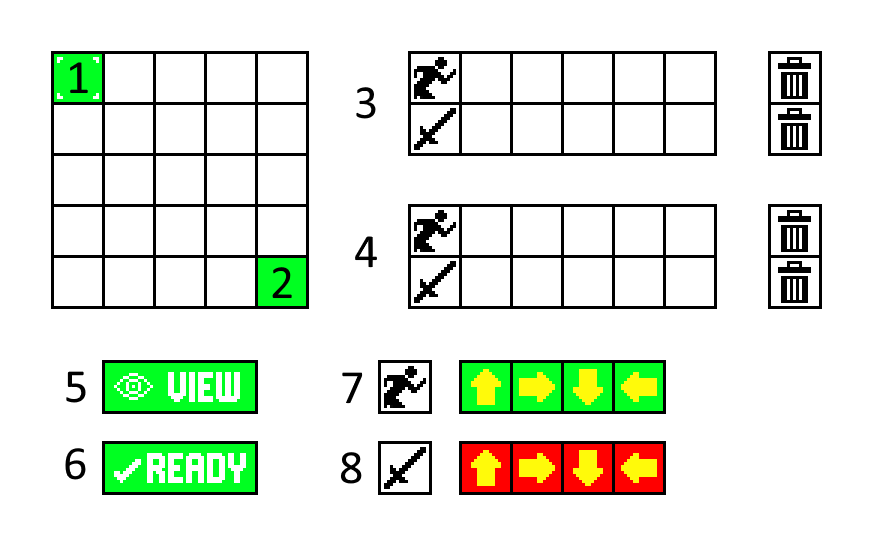

# clockwork
This is a prototype of an idea for a game I had. While slightly buggy, unpolished and boring to look at, it has the same idea in essence.

# How to Play

1. The current player character. Switches when "Ready" (6) is pressed.
2. The opponent.
3. The current player's move queue. The row with the run icon corresponds to moves being made. The row with the sword icon corresponds to the direciton of attack. Clicking on a square (should) change the currently selected move. The trash can will delete the currently selected move.
4. The enemy player's move queue. This is only used for simulating the turn when "View" (5) is pressed.
5. View the current moves selected. Purely visual, but useful for planning out your turn.
6. If you are Player 1, confirms your move selections. If you are Player 2, confirms your move selections, then makes the selected moves for both players.
7. Move bank. Click on an icon to add it to the currently selected player's move queue.
8. Attack bank. See above.

# Gameplay

Players plan out their turns ahead of time and both player's moves are executed at the same time. To win, one player must be adjacent to another player and be attacking in their direction, indicated with a red line on the attacking side. If both players are attacking eachother, nothing will happen. Players can pass through eachother unharmed.
